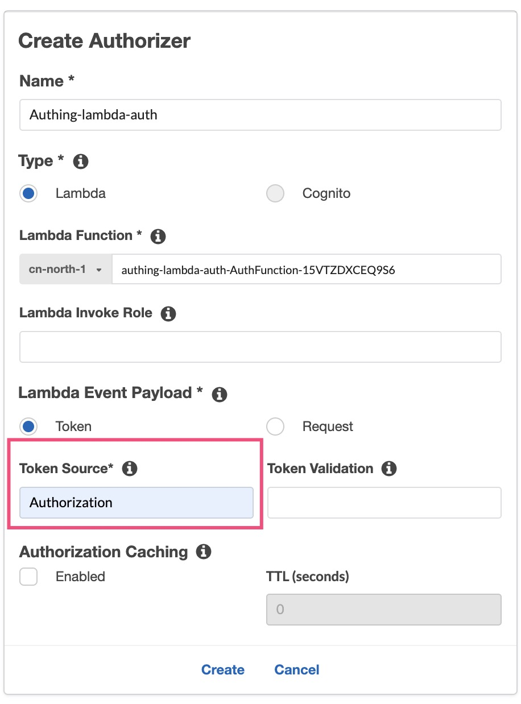
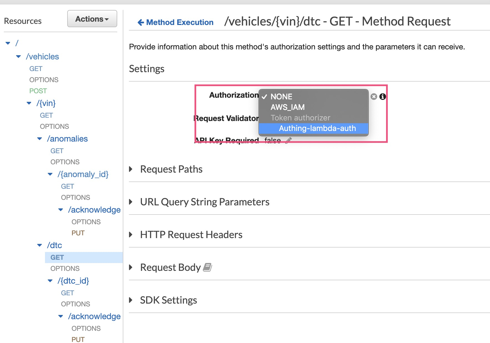

# AWS Connected Vehicle Solution for AWS China Region
The AWS Connected Vehicle Solution is a reference implementation that provides a foundation for automotive product transformations for connected vehicle services, autonomous driving, electric powertrains, and shared mobility.

This project is to migrate the solution to AWS China Region. As some services such as AWS Cognito, Kinesis Analytics are not available in China region, this project will remove the dependancy on these serives and use 3rd party solutions (either open source or SaaS) to replace them. For exmaple, [Authing.cn](https://authing.cn) is leveraged to replace AWS Cognito user pool, for demo purpose. Note that this solution is not tighted to Authing and you may choose [Auth0](https://auth0.com) or other authentication service you like.

## Getting Started
To get started with the AWS Connected Vehicle Solution, please review the solution documentation. https://aws.amazon.com/answers/iot/connected-vehicle-solution/

Detailed  information about deploying this solutuion in AWS China region is documented here. Deploying the solution in AWS Global Region could be checked in this [repo](https://github.com/awslabs/aws-connected-vehicle-solution) from which this project forked.

## Instructions on deployment in AWS China Region 

### 1. Deploy Connected Vehicle Solution ( without authorizer for API Gateway )

Use following link to deploy the solution with a modified Cloudformation template. Currently only Beijing Region(cn-north-1) is supported. We will support Ningxia Region as well when the the solution is finalized.

You coudld find the template [here](deployment/aws-connected-vehicle-solution-cn.template).

### 2. Deploy a Lambda Authorizer for API Gateway using Authing.cn

//TODO: Working to change it to a Cloudformation template for easier deployment.

#### 2.1 Deploy Lambda function which would be used as Lambda authorizer
You could leverage this [repo](https://github.com/linjungz/authing-Lambda-auth) for deploying a Lambda function that would be used as a Lambda authorizer for API Gateway in Connected Vehicle Solution. Currently you need [SAM](https://aws.amazon.com/serverless/sam/) for deploying the Lambda function to AWS China region 

If you choose other authentication service such as Auth0, you need to rewrite the lambda function for validate the token. Kindly refer to the [sample code](https://docs.aws.amazon.com/apigateway/latest/developerguide/apigateway-use-lambda-authorizer.html) for lambda authorizer in AWS documentation.

#### 2.2 Create Lambda Authorizer for API Gateway

In AWS Console locate the API Gateway "Vehicle Services API" that's created in Step 1 and [create a lambda authorizer](https://docs.aws.amazon.com/apigateway/latest/developerguide/configure-api-gateway-lambda-authorization-with-console.html). Create a lambda authorizer which would use the Lambda function we created in Step 2.1. Here's the configuration:

And change each Method Request to use the Lambda authorizer: 

#### 2.3 Change APP Secret for Authing.cn

Authing.cn is ID as a service which I leverage as a authorization service and JWT would be sent to Lambda authorizer for validation. You could apply a free Authing.cn account and create a OIDC application for test. Kindly refer to these two links for [OIDC](https://authing.cn/blog/5-%E5%88%86%E9%92%9F%E7%90%86%E8%A7%A3%E4%BB%80%E4%B9%88%E6%98%AF-OIDC/) and [Authing configuration](https://blog.csdn.net/chidongzhou7494/article/details/101003055). 

App Secret is stored in Lambda function environment varaible and you could change it to your app secret for Authing.

## File Structure
The AWS Connected Vehicle Solution project consists of microservices that facilitate the functional areas of the platform. These microservices are deployed to a serverless environment in AWS Lambda.

<pre>
|-source/
  |-services/
    |-helper/       [ AWS CloudFormation custom resource deployment helper ]
  |-services/
    |-anomaly/      [ microservice for humanization and persistence of identified anomalies ]
    |-driversafety/ [ microservice to orchestrate the creation of driver scores ]
    |-dtc/          [ microservice to orchestrate the capture, humanization and persistence of diagnostic trouble codes ]
    |-jitr/         [ microservice to orchestrate registration and policy creation for just-in-time registration of devices ]    
    |-notification/ [ microservice to send SMS and MQTT notifications for the solution ]
    |-vehicle/      [ microservice to provide proxy interface for the AWS Connected Vehicle Solution API ]    
</pre>

Each microservice follows the structure of:

<pre>
|-service-name/
  |-lib/
    |-[ service module libraries and unit tests ]
  |-index.js [ injection point for microservice ]
  |-package.json
</pre>

***